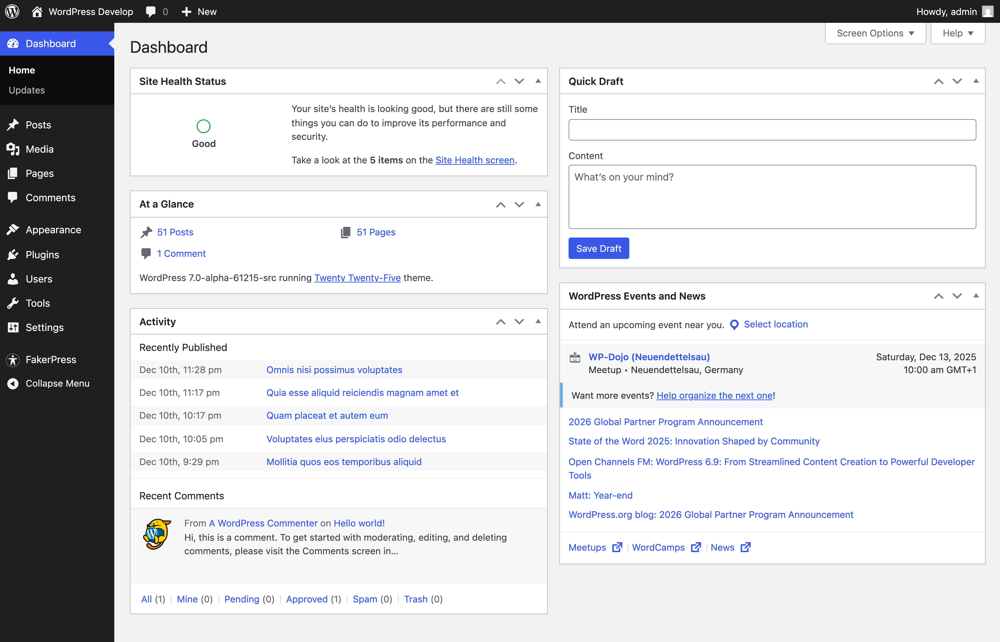
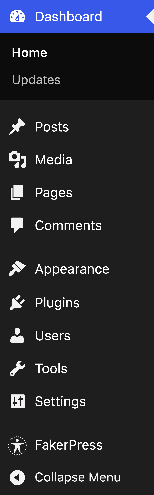
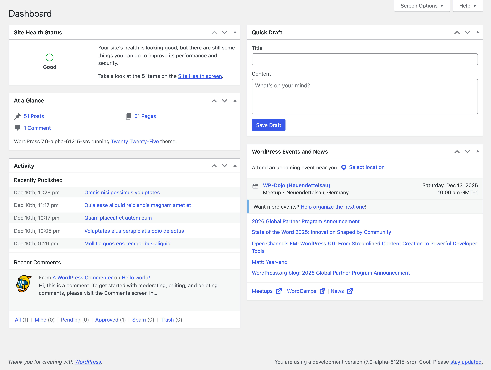
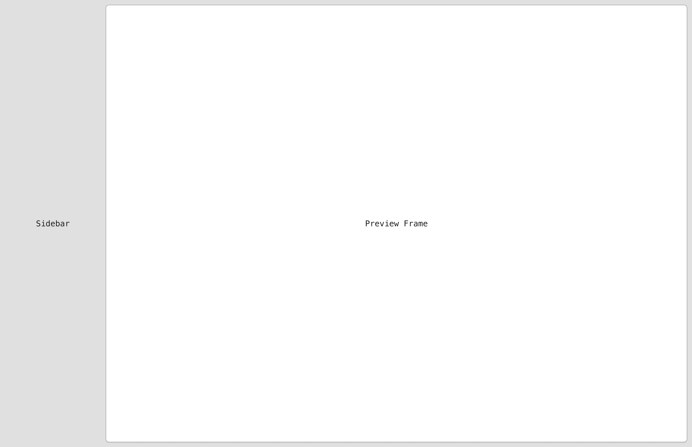
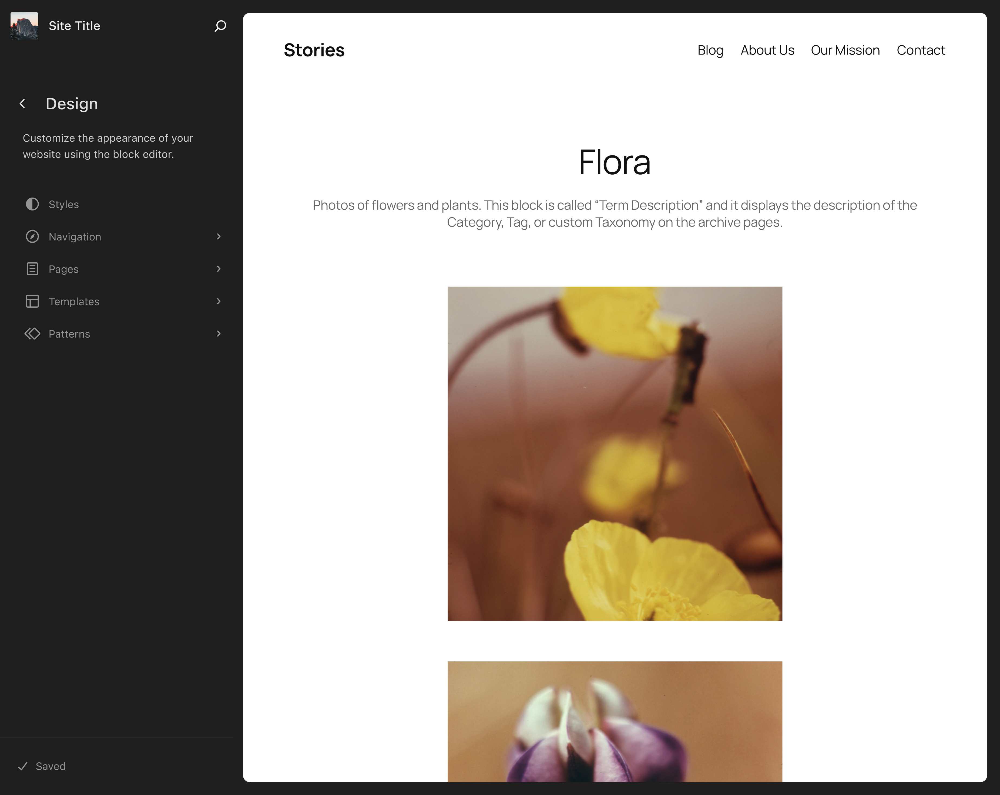
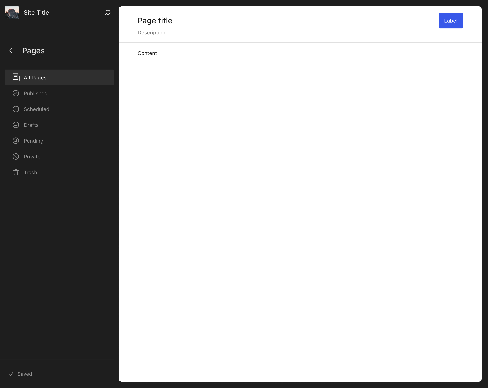

# Background and frame

## Why this matters

The global background and the admin frame (admin menu and admin bar) define the overall feel of wp-admin. Even small changes here can make classic screens feel more cohesive with the rest of WordPress. One thing to keep in mind is that changes in the frame are highly visible and can create strong feedback quickly.

## What is the "Admin Frame"?

The "Admin Frame" refers to the visual appearance of the main sidebar navigation and admin bar. These elements surround every screen in wp-admin and have a significant impact on the overall perceived quality of the interface.

### The current admin

The first approach would be to simply update the spacing, sizing, and component styles without making any changes to the frame itself.


To some tastes, this feels like an odd interim step that does not fully resolve the discrepancy between modern screens and older screens.

### The Site Editor for comparison

If we compare the classic admin with the Site Editor, there is a noticeable discrepancy between the two visual languages.


### A modern take on the admin frame

This screenshot shows what the same screen from the first image looks like with a more modern take on the admin frame, inspired by the work already done in the Site Editor.


For more context, see [Trac ticket #64308 comment:1](https://core.trac.wordpress.org/ticket/64308#comment:1).

## Scope

- Global background color and base page surfaces.
- Optional frame restyling using existing DOM only:
  - Admin menu
  - Admin bar
  - Selected and hover states

## Non goals

- No layout restructure.
- No site editor style sidebar architecture changes that require markup.
- No new CSS custom properties for neutrals or surfaces.

## Current WP Admin frame

### Full dashboard view



### Admin menu



### Admin bar


### Content area background



## Figma Design Reference

### Admin Frame



### Site Editor Reference

The Site Editor provides a reference for the target visual direction.



### Site Editor Preview



## Design specifications from Figma

### Global background

The design system uses a light gray background to create separation between the page and card surfaces:

| Property | Value |
|----------|-------|
| Page background | #f0f0f0 (gray-100) |
| Card/content surface | #ffffff |

This creates clear visual hierarchy where white cards "float" on the gray background.

### Gray scale reference

| Token | Value | Usage |
|-------|-------|-------|
| gray-100 | #f0f0f0 | Backgrounds, disabled inputs |
| gray-400 | #cccccc | Disabled borders |
| gray-600 | #949494 | Input borders, disabled text |
| gray-900 | #1e1e1e | Primary text |

### Admin menu

While the admin menu is largely scheme-dependent, alignment with the design system suggests:

| Property | Current | Suggested |
|----------|---------|-----------|
| Menu item height | Variable | Standardize to grid unit (40px or 48px) |
| Icon size | 20px | 20px (unchanged) |
| Text size | 14px | 13px (align with design system body) |
| Active indicator | Left border or background | Left border accent with theme color |

### Admin bar

| Property | Suggested |
|----------|-----------|
| Height | 32px (unchanged for compatibility) |
| Background | Scheme-dependent (no change) |
| Text | 13px, scheme text color |

## Requirements

### Global background

Define Sass token:

```scss
$global-bg: #f0f0f0; // gray-100
```

- Update `body` and `#wpcontent` background.
- Ensure sufficient contrast with white card surfaces.
- Test that existing plugins with custom backgrounds still work.

### Admin menu and admin bar

- Use existing selectors in:
  - `src/wp-admin/css/admin-menu.css`
  - `src/wp-includes/css/admin-bar.css`
- Align spacing to 4px grid.
- Use `var(--wp-admin-theme-color)` for active accents.
- Consider standardizing menu item height to 40px or 48px.

### Accessibility

- Focus styles must remain visible and use `var(--wp-admin-border-width-focus)` when applied.
- Ensure contrast for menu text and icons meets WCAG AA (4.5:1 for text, 3:1 for UI elements).

## Deliverables

- Global background updates in core CSS.
- If included, a frame styling patch that is separable and revertable.

## Discussion checkpoints

### Include or defer frame work

Decisions to capture:

- Whether frame styling is in scope for 7.0.
- If included, define the exact constraints and visual targets.

## Acceptance criteria

- Background feels aligned with design direction across major screens.
- No regressions in menu usability or selected state clarity.
- No new CSS custom properties were introduced.

## Testing notes

It is recommended to test the frame in daily navigation flows:

1. Dashboard
2. Settings
3. Posts list

Test in multiple admin schemes.

