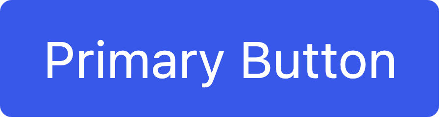
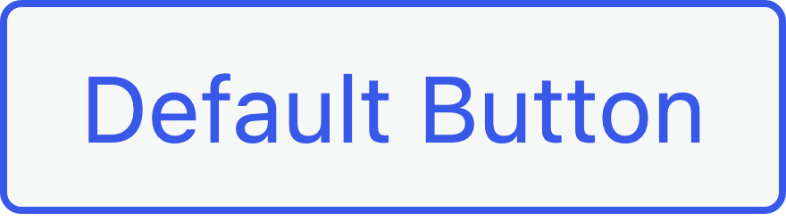
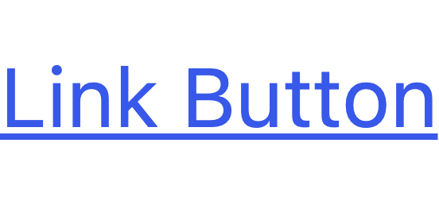
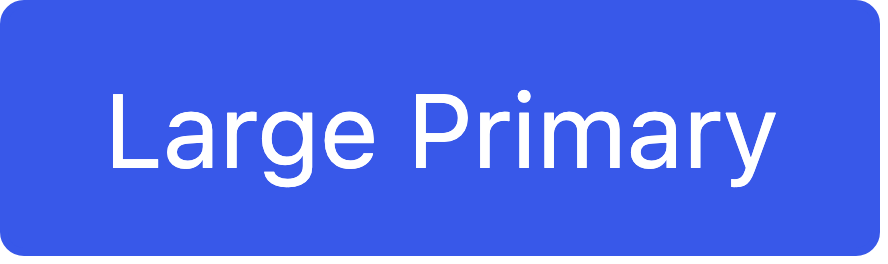
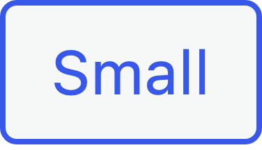
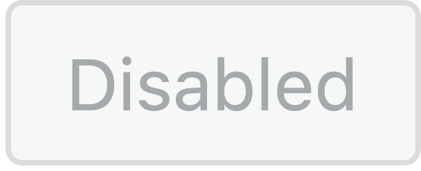
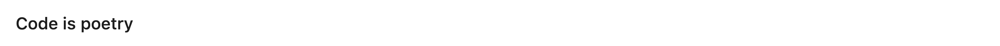
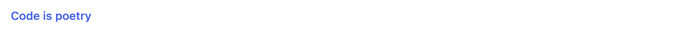

# Buttons reskin

## Why this matters

Buttons are one of the most common interactive elements in wp-admin. Consistent button styling improves editor experience and reduces mismatch between classic screens and newer interfaces. This is useful because it creates a reliable interaction language across the entire admin.

## Component inventory

### Primary buttons

Used for the main action on a screen. There should typically be only one primary button visible at a time.

```html
<button type="button" class="button button-primary">Primary Button</button>
<input type="submit" class="button button-primary" value="Save Changes">
```

### Secondary buttons

Used for secondary actions that are less prominent than primary.

```html
<button type="button" class="button button-secondary">Secondary Button</button>
<button type="button" class="button">Default Button</button>
```

### Link buttons

Used for tertiary actions that should appear inline with text.

```html
<button type="button" class="button-link">Link Button</button>
<button type="button" class="button-link-delete">Delete</button>
```

### Button states

All button variants support the following states:
- Default
- Hover
- Focus (with visible focus ring)
- Active/Pressed
- Disabled

```html
<button type="button" class="button button-primary" disabled>Disabled</button>
```

## Where buttons are used

Buttons appear on nearly every admin screen. Key locations include:

| Location | Button types | Notes |
|----------|--------------|-------|
| **Settings pages** | Primary submit, secondary reset | Bottom of form tables |
| **Post editor** | Primary publish, secondary save draft | Publish metabox |
| **Plugins list** | Primary activate, link deactivate | Row actions and bulk actions |
| **Media library** | Primary insert, secondary cancel | Modal dialogs |
| **Dashboard widgets** | Link buttons in Quick Draft | Compact button usage |
| **List table bulk actions** | Secondary apply button | Paired with select dropdown |

## Scope

Update button styles across wp-admin without changing markup:

- Primary buttons
- Secondary buttons
- Tertiary or default buttons where applicable
- Link style buttons
- Destructive variants
- Disabled states
- Focus states

## Non goals

- No new button classes.
- No changes to button markup, attributes, or JS behaviors.
- No new CSS custom properties for button tokens.

## Primary selectors and surfaces

Core selectors that must remain supported include:

- `.wp-core-ui .button`
- `.wp-core-ui .button-primary`
- `.wp-core-ui .button-secondary`
- `.wp-core-ui .button-link`
- `.wp-core-ui .button-link-delete`
- `.wp-core-ui .button[disabled]`

### Source files

| File | Line | Purpose |
|------|------|---------|
| [`colors/_admin.scss`](https://github.com/WordPress/wordpress-develop/blob/trunk/src/wp-admin/css/colors/_admin.scss#L40) | L40 | `.button-link` styles |
| [`colors/_admin.scss`](https://github.com/WordPress/wordpress-develop/blob/trunk/src/wp-admin/css/colors/_admin.scss#L111) | L111 | `.button` color definitions |
| [`common.css`](https://github.com/WordPress/wordpress-develop/blob/trunk/src/wp-admin/css/common.css#L135) | L135 | `.button .screen-reader-text` |
| [`common.css`](https://github.com/WordPress/wordpress-develop/blob/trunk/src/wp-admin/css/common.css#L1736) | L1736 | `.button-primary.updating-message` |
| [`forms.css`](https://github.com/WordPress/wordpress-develop/blob/trunk/src/wp-admin/css/forms.css) | - | Submit button in form contexts |
| [`login.css`](https://github.com/WordPress/wordpress-develop/blob/trunk/src/wp-admin/css/login.css) | - | Login form button styles |

## Current WP Admin buttons

### Individual button components

| Component | Screenshot |
|-----------|------------|
| Primary |  |
| Secondary |  |
| Default |  |
| Link |  |
| Delete Link |  |
| Large |  |
| Small |  |
| Hero |  |
| Disabled |  |

## Real-world examples

Screenshots captured from actual WP Admin pages at 8x resolution.

| Context | Screenshot |
|---------|------------|
| Settings page submit |  |
| Quick Draft save |  |
| Bulk actions apply |  |

## Gutenberg Design System (Storybook)

Screenshots from the [Gutenberg Storybook](https://wordpress.github.io/gutenberg/?path=/docs/components-button--docs) showing the target design.

| Variant | Screenshot |
|---------|------------|
| Default |  |
| Primary |  |
| Secondary |  |
| Tertiary |  |
| Link |  |
| Icon |  |

## Design specifications from Figma

**Figma reference:** [Button component](https://www.figma.com/design/804HN2REV2iap2ytjRQ055/WordPress-Design-System?node-id=16507-33913)

### Button sizes

Gutenberg is transitioning to 40px as the default button size (see `$button-size-next-default-40px` in Gutenberg). This reskin adopts 40px as the new default to align with that direction.

| Size | Class | Height | line-height | Padding | Use case |
|------|-------|--------|-------------|---------|----------|
| Default | `.button` | 40px | 2.92 (38px) | 0 16px | Standard buttons |
| Compact | `.button-compact` | 32px | 2.31 (30px) | 0 12px | Space-constrained contexts |
| Small | `.button-small` | 24px | 2 (22px) | 0 8px | Inline or minimal UI |
| Hero | `.button-hero` | 48px | 3.29 (46px) | 0 36px | Welcome screens, CTAs |

One thing to keep in mind is that the height is achieved via `min-height` combined with `line-height`, not a fixed `height`. This ensures buttons scale properly with browser zoom for accessibility.

### Typography

All buttons use:
- Font family: System font stack (SF Pro in design, maps to existing WP stack)
- Font size: 13px
- Font weight: 500 (medium)
- Line height: 20px

### Border radius

All buttons should use a 2px border radius, matching the design system `radius-s` token.

```scss
$button-border-radius: 2px;
```

### Color specifications

#### Primary buttons

| State | Background | Text | Border |
|-------|------------|------|--------|
| Default | `var(--wp-admin-theme-color)` | #ffffff | none |
| Hover | `var(--wp-admin-theme-color-darker-10)` | #ffffff | none |
| Active | `var(--wp-admin-theme-color-darker-20)` | #ffffff | none |
| Disabled | #f0f0f0 | #949494 | none |

#### Secondary buttons

| State | Background | Text | Border |
|-------|------------|------|--------|
| Default | #ffffff | `var(--wp-admin-theme-color)` | 1px `var(--wp-admin-theme-color)` |
| Hover | #ffffff | `var(--wp-admin-theme-color-darker-10)` | 1px darker |
| Active | #ffffff | `var(--wp-admin-theme-color-darker-20)` | 1px darker |
| Disabled | #f0f0f0 | #949494 | 1px #cccccc |

#### Tertiary/Default buttons

| State | Background | Text | Border |
|-------|------------|------|--------|
| Default | transparent | #1e1e1e | none |
| Hover | rgba(0,0,0,0.05) | #1e1e1e | none |
| Active | rgba(0,0,0,0.1) | #1e1e1e | none |
| Disabled | transparent | #949494 | none |

#### Link buttons

| State | Text color |
|-------|------------|
| Default | `var(--wp-admin-theme-color)` |
| Hover | `var(--wp-admin-theme-color-darker-10)` |
| Active | `var(--wp-admin-theme-color-darker-20)` |
| Disabled | #949494 |

#### Destructive variants

For destructive actions, replace theme color with:
- Default: #cc1818
- Hover: darker variant
- Active: darker variant

### Focus ring

| Property | Value |
|----------|-------|
| Width | `var(--wp-admin-border-width-focus)` (1.5px) |
| Color | #4465db (brand-9) |
| Offset | -1px (inset) |
| Border radius | 4px (slightly larger than button radius) |

## Requirements

### Theme color usage

It is recommended to treat the scheme variables as the single accent contract for buttons.

- Use `var(--wp-admin-theme-color)` for primary button background and accents.
- Use `var(--wp-admin-theme-color-darker-10)` and `var(--wp-admin-theme-color-darker-20)` for hover and active states.
- Any `rgba()` usage should use the `--rgb` variants.

### Focus treatment

One thing to keep in mind is that focus styling is both a usability feature and an accessibility requirement.

- Focus ring width should use `var(--wp-admin-border-width-focus)`.
- Focus ring color should be #4465db or the equivalent theme darker variant.
- Focus ring should appear 1px inside the button edge with 4px border radius.
- This comes with a few caveats. If you add transitions, ensure `prefers-reduced-motion: reduce` disables them.

### Layout and spacing

- Default button height is now 40px (aligned with Gutenberg's next-default-40px).
- Compact buttons (32px) available via `.button-compact` for space-constrained contexts.
- Horizontal padding: 16px (default), 12px (compact), 8px (small).
- Border radius: 2px.
- Use Sass tokens for all spacing values to maintain consistency.

### Accessibility requirements

- Ensure text contrast meets WCAG AA (4.5:1 for normal text).
- Disabled buttons should use #949494 text on #f0f0f0 background.
- Ensure `:focus-visible` is handled where possible, while keeping legacy focus behavior intact.

## Deliverables

- Updated button styles in core admin CSS.
- A small visual test page or reference set of admin screens to validate.

## Discussion checkpoints

### Button shape and density

Decisions to capture:

- Target border radius for standard buttons.
- Target padding for small and large variants.

### Destructive patterns

Decisions to capture:

- How destructive buttons map to design system intent colors without new CSS vars.

## Acceptance criteria

- Primary, secondary, and link buttons match the approved design direction.
- Focus rings are consistent across schemes and visible at 100 percent and 200 percent zoom.
- No new CSS custom properties were introduced.
- No selector removals or renames.

## Testing notes

It is recommended to test buttons in workflows, not in isolation:

1. Dashboard widgets
2. Posts list bulk actions
3. Settings pages
4. Plugin install and updates

Test in at least two admin schemes including modern and light.

