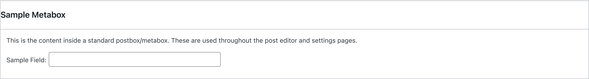
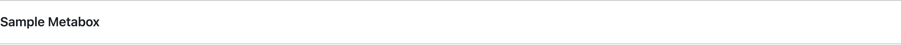
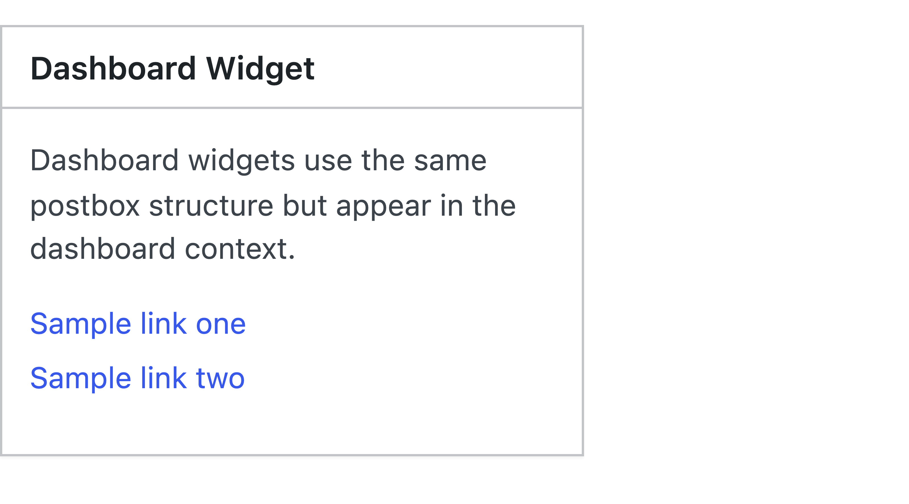
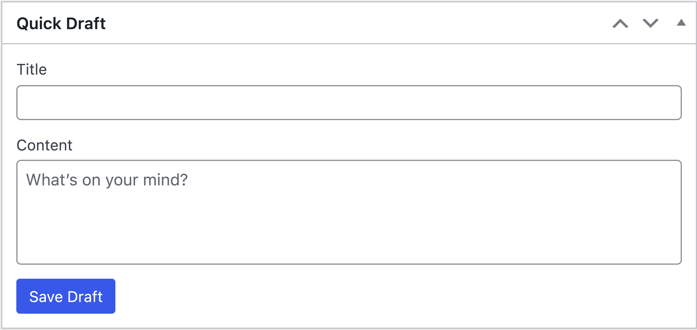
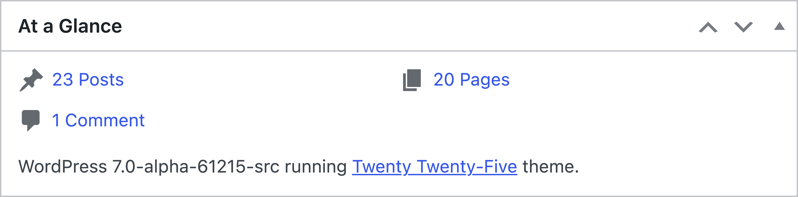
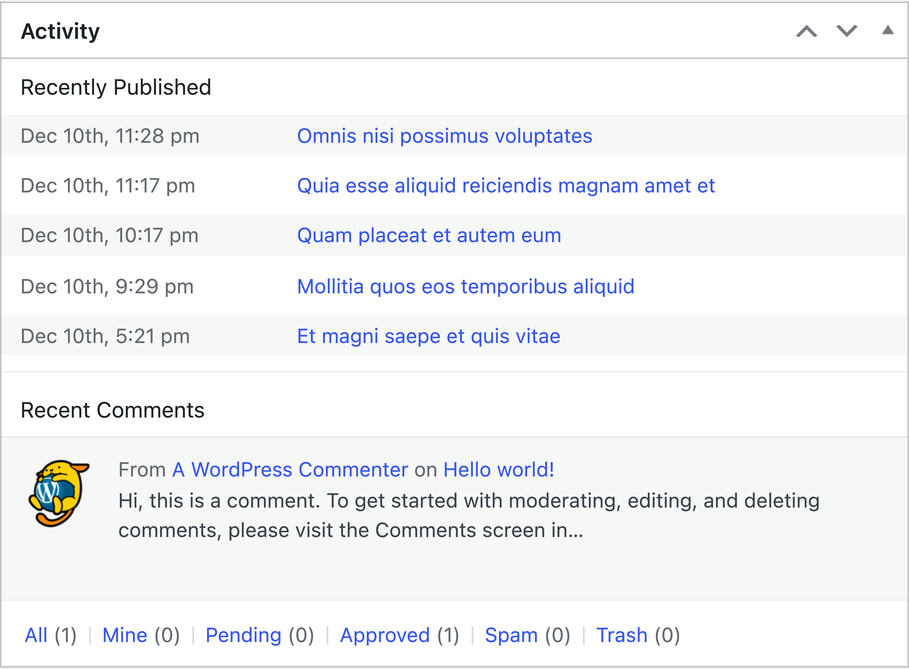
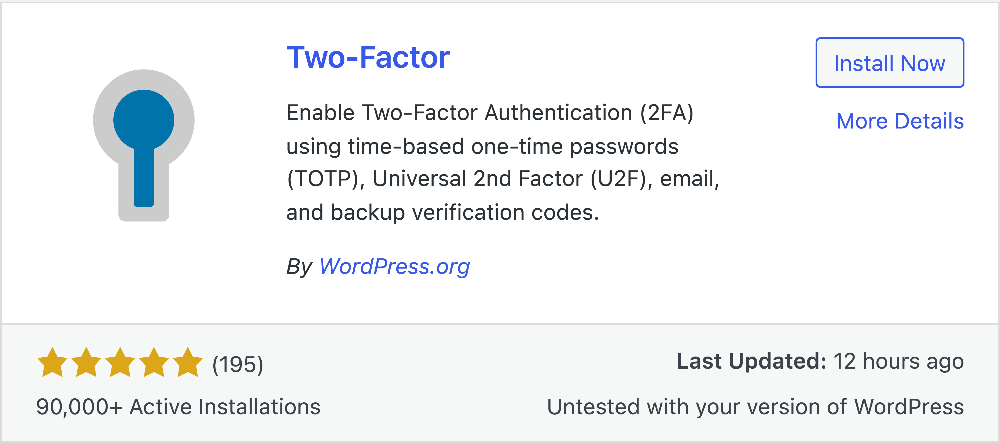
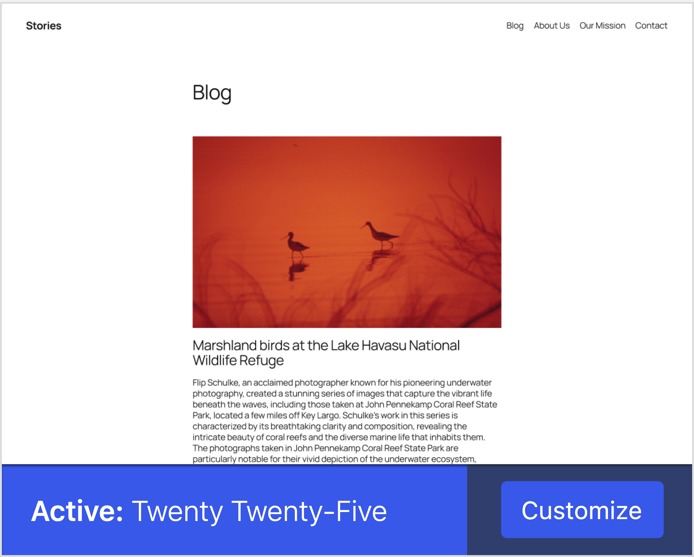

# Cards reskin

## Why this matters

Cards, metaboxes, and dashboard widgets are the primary layout containers in many wp-admin screens. Updating them creates a strong sense of cohesion across old and new interfaces while keeping markup parity. This is useful because container styling influences the entire perceived quality of the admin.

## Component inventory

### Postbox / Metabox

The primary card container used for metaboxes in the post editor and dashboard widgets.

```html
<div class="postbox">
    <div class="postbox-header">
        <h2 class="hndle">Widget Title</h2>
        <div class="handle-actions">
            <button type="button" class="handlediv">
                <span class="toggle-indicator"></span>
            </button>
        </div>
    </div>
    <div class="inside">
        <p>Widget content goes here.</p>
    </div>
</div>
```

### Dashboard widget

Dashboard widgets use the postbox structure with additional dashboard-specific classes.

```html
<div id="dashboard_quick_press" class="postbox">
    <div class="postbox-header">
        <h2 class="hndle">Quick Draft</h2>
    </div>
    <div class="inside">
        <form id="quick-press">
            <!-- Quick Draft form -->
        </form>
    </div>
</div>
```

### Welcome panel

A special card used on the Dashboard for onboarding.

```html
<div id="welcome-panel" class="welcome-panel">
    <div class="welcome-panel-content">
        <h2>Welcome to WordPress!</h2>
        <p class="about-description">Getting started content.</p>
    </div>
</div>
```

### Plugin card

Grid cards used in Plugins > Add New.

```html
<div class="plugin-card plugin-card-example">
    <div class="plugin-card-top">
        <div class="name column-name">
            <h3>
                <a href="#">Plugin Name
                    
                </a>
            </h3>
        </div>
        <div class="action-links">
            <ul class="plugin-action-buttons">
                <li><button class="button button-primary">Install Now</button></li>
            </ul>
        </div>
        <div class="desc column-description">
            <p>Description text.</p>
        </div>
    </div>
    <div class="plugin-card-bottom">
        <div class="vers column-rating">...</div>
        <div class="column-updated">...</div>
    </div>
</div>
```

### Theme card

Grid cards used in Appearance > Themes.

```html
<div class="theme-browser rendered">
    <div class="themes">
        <div class="theme active" tabindex="0">
            <div class="theme-screenshot">
                
            </div>
            <div class="theme-id-container">
                <h2 class="theme-name">Theme Name</h2>
                <div class="theme-actions">
                    <a class="button button-primary customize">Customize</a>
                </div>
            </div>
        </div>
    </div>
</div>
```

## Where cards are used

| Location | Card types | Notes |
|----------|------------|-------|
| **Dashboard** | Postbox widgets, welcome panel | Quick Draft, Activity, Site Health |
| **Post editor** | Metaboxes | Publish, Categories, Tags, Featured Image |
| **Plugins > Add New** | Plugin cards | Grid layout with install actions |
| **Appearance > Themes** | Theme cards | Grid layout with activate/customize |
| **Settings pages** | Form sections | Some settings use card-like containers |
| **Widgets screen** | Widget containers | Sidebar widget management |

## Scope

Reskin container components without markup changes:

- Metaboxes and postboxes
- Dashboard widgets
- Welcome panel
- Plugin cards
- Theme cards
- Generic boxed sections that behave like cards

## Non goals

- No changes to collapse behavior or drag and drop interactions.
- No new CSS custom properties for surfaces, borders, or elevation.
- No changes to markup structure.

## Current WP Admin cards

### Individual card components

| Component | Screenshot |
|-----------|------------|
| Postbox |  |
| Postbox header |  |
| Dashboard widget |  |

## Real-world examples

Screenshots captured from actual WP Admin pages at 8x resolution.

| Context | Screenshot |
|---------|------------|
| Quick Draft widget (Dashboard) |  |
| At a Glance widget (Dashboard) |  |
| Activity widget (Dashboard) |  |
| Plugin card (Plugins > Add New) |  |
| Theme card (Appearance > Themes) |  |

## Design specifications from Figma

**Figma reference:** [Card component](https://www.figma.com/design/804HN2REV2iap2ytjRQ055/WordPress-Design-System?node-id=16532-44253)

### Card sizes and padding

The design system defines four card sizes:

| Size | Horizontal padding | Vertical padding |
|------|-------------------|------------------|
| xSmall | 8px | 8px |
| Small | 16px | 16px |
| Medium | 24px | 16px |
| Large | 32px | 24px |

WP Admin metaboxes and dashboard widgets should map to Small or Medium.

### Surface styling

| Property | Value |
|----------|-------|
| Background | #ffffff (white) |
| Border | 1px solid rgba(0,0,0,0.1) |
| Border radius | 8px (radius-l) for rounded cards, 0 for square |

### Header and footer

| Property | Value |
|----------|-------|
| Header border | 1px solid rgba(0,0,0,0.1) (bottom) |
| Footer border | 1px solid rgba(0,0,0,0.1) (top) |
| Header/Footer padding | Same as card size |

### Divider

When used between sections:

| Property | Value |
|----------|-------|
| Height | 1px |
| Color | rgba(0,0,0,0.1) |

### Media section

For cards with media content:

| Property | Value |
|----------|-------|
| Background | rgba(56,88,233,0.04) (theme-alpha-04) |

### Mapping to WP Admin components

| WP Admin component | Recommended card size | Border radius |
|-------------------|----------------------|---------------|
| Dashboard widget | Small (16px) | 8px |
| Post editor metabox | Small (16px) | 0 (existing behavior) |
| Welcome panel | Medium (24px/16px) | 8px |
| Plugin card | Small (16px) | 8px |
| Theme card | Medium (24px/16px) | 8px |

## Requirements

### Surface and elevation

Define Sass tokens:

```scss
$card-bg: #ffffff;
$card-border-color: rgba(0, 0, 0, 0.1);
$card-border-width: 1px;
$card-border-radius: 8px; // radius-l
$card-divider-color: rgba(0, 0, 0, 0.1);
```

- Background should be white (#ffffff).
- Border should be subtle (10% black).
- No box-shadow in the base design (elevation is optional).

### Spacing

Sass spacing tokens:

```scss
$card-padding-xs: 8px;
$card-padding-sm: 16px;
$card-padding-md-h: 24px;
$card-padding-md-v: 16px;
$card-padding-lg-h: 32px;
$card-padding-lg-v: 24px;
```

### Typography

- Card headers use the same text color as body (#1e1e1e).
- Font size and weight should align with existing metabox header styling.

### Interaction states

- Hover and focus states for interactive elements inside cards must remain visible.
- Any focus ring widths must respect `var(--wp-admin-border-width-focus)` where applicable.
- Collapse toggle buttons should have visible focus states.

## Deliverables

- Updated card styles applied to:
  - `.postbox` and related selectors
  - `.stuffbox` and similar legacy containers
  - Dashboard widget containers

## Discussion checkpoints

### Elevation usage

Decisions to capture:

- Whether elevation is applied to all cards or only key containers.
- Preferred shadow strength for the admin context.

### Border radius strategy

Decisions to capture:

- Radius values for cards versus inputs and buttons.

## Acceptance criteria

- Cards look consistent across dashboard, post editor, and settings screens.
- No visual regressions in collapsed metaboxes or draggable behavior.
- Surfaces and borders meet contrast requirements.
- No new CSS custom properties were introduced.

## Testing notes

It is recommended to test cards in screens where metaboxes are heavily used:

1. Dashboard
2. Post editor metaboxes
3. Widgets screen and customizer contexts

Test in multiple admin color schemes.

