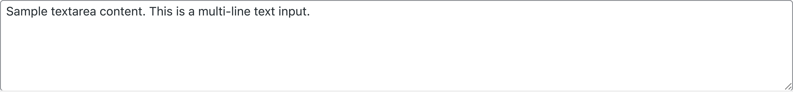
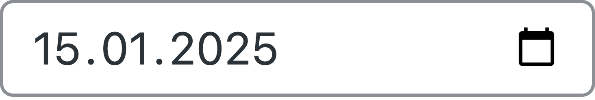
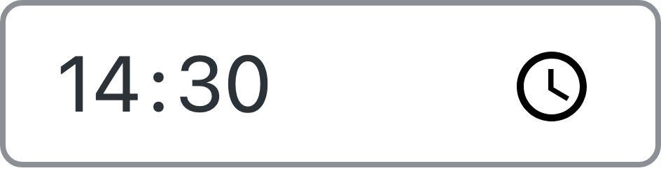
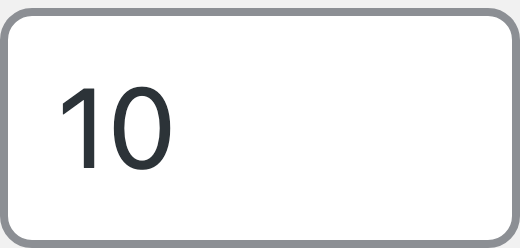
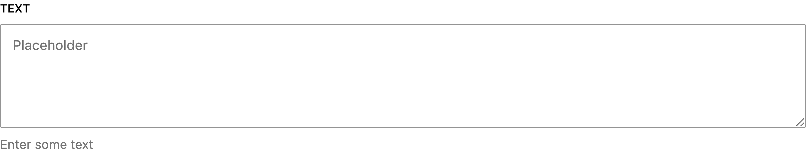
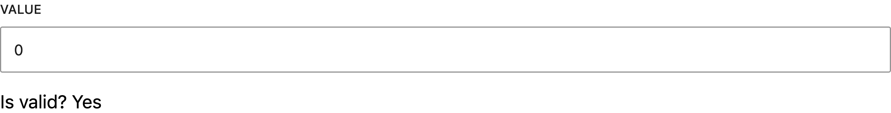
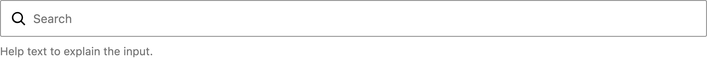
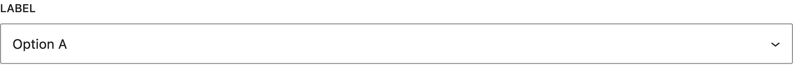
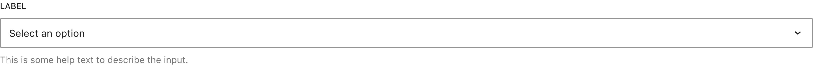

# Inputs reskin

## Why this matters

Inputs are the backbone of admin workflows. A consistent input system improves usability, reduces cognitive load, and makes older screens feel closer to the editor experience users already know. In short, this is one of the fastest ways to make wp-admin feel modern without changing architecture.

## Component inventory

### Text inputs

Standard text inputs with sizing classes.

```html
<input type="text" class="regular-text" value="Standard width input">
<input type="text" class="large-text" value="Full width input">
<input type="text" class="small-text" value="Small">
```

### Specialized text inputs

URL, email, and code inputs use additional classes for styling.

```html
<input type="url" class="regular-text code" value="https://example.com">
<input type="email" class="regular-text ltr" value="admin@example.com">
<input type="text" class="regular-text code" value="function example() {}">
```

### Number inputs

Used for numeric values, often paired with labels.

```html
<input type="number" class="small-text" value="10" step="1" min="1"> posts
```

### Password inputs

Standard and with visibility toggle.

```html
<input type="password" class="regular-text" autocomplete="off">

<!-- Password with toggle (Settings > Reading pattern) -->
<span class="wp-pwd">
    <input type="password" class="regular-text ltr" data-reveal="1">
    <button type="button" class="button wp-hide-pw" data-toggle="0">
        <span class="dashicons dashicons-visibility"></span>
    </button>
</span>
```

### Select dropdowns

```html
<select>
    <option value="">Select an option</option>
    <option value="1">Option One</option>
    <option value="2">Option Two</option>
</select>
```

### Textareas

```html
<textarea class="large-text" rows="5">Multi-line content</textarea>
```

### Checkboxes

```html
<fieldset>
    <label>
        <input type="checkbox" name="option" value="1" checked>
        Enable this feature
    </label>
</fieldset>
```

### Radio buttons

```html
<fieldset>
    <label>
        <input type="radio" name="group" value="option1" checked>
        First option
    </label>
    <br>
    <label>
        <input type="radio" name="group" value="option2">
        Second option
    </label>
</fieldset>
```

### Search box

```html
<p class="search-box">
    <label class="screen-reader-text" for="search">Search</label>
    <input type="search" id="search" name="s" value="">
    <input type="submit" class="button" value="Search">
</p>
```

## Where inputs are used

| Location | Input types | Notes |
|----------|-------------|-------|
| **Settings > General** | Text, URL, email, select | Site title, URL, admin email, timezone |
| **Settings > Reading** | Number, password with toggle | Posts per page, mail server password |
| **Settings > Media** | Number (dimensions) | Thumbnail, medium, large sizes |
| **Settings > Discussion** | Number, checkbox, textarea | Comment settings, moderation |
| **Post editor metaboxes** | Text, textarea, checkbox | Custom fields, excerpt |
| **User profile** | Text, email, password | Account settings |
| **Plugin search** | Search box | Filter bar on Plugins > Add New |

## Scope

Reskin the following without markup changes:

- Text inputs, URL, email, password, number, search
- Selects
- Textareas
- Checkboxes
- Radio buttons
- Disabled, read only, invalid, and focus states

## Non goals

- No markup changes and no JS changes.
- No new CSS custom properties for input tokens.
- No change to functional behavior such as validation, sizing, or keyboard interactions.

## Primary files and selectors

Primary surfaces include:

- `src/wp-admin/css/forms.css`
- `src/wp-admin/css/common.css` (shared control patterns)

Common selectors include:

- `input[type="text"]`, `input[type="url"]`, `input[type="email"]`, `input[type="password"]`, `input[type="number"]`
- `select`, `textarea`
- `input[type="checkbox"]`, `input[type="radio"]`
- `.small-text`, `.regular-text`, `.large-text` sizing helpers
- `.code`, `.ltr` modifier classes
- `.wp-pwd`, `.wp-hide-pw` password toggle pattern
- `.search-box` search form pattern

## Current WP Admin inputs

### Individual input components

| Component | Screenshot |
|-----------|------------|
| Text input |  |
| Large text |  |
| Small text |  |
| Disabled |  |
| Readonly |  |
| Textarea |  |
| Select |  |
| Checkbox |  |
| Radio |  |
| Search |  |
| URL |  |
| Email |  |
| Number |  |
| Password |  |
| Password toggle |  |
| Date |  |
| Time |  |
| Color |  |
| File |  |
| Range |  |

## Real-world examples

Screenshots captured from actual WP Admin pages at 8x resolution.

| Context | Screenshot |
|---------|------------|
| Site Title (Settings > General) |  |
| Site URL (Settings > General) |  |
| Admin Email (Settings > General) |  |
| Timezone (Settings > General) |  |
| Posts per page (Settings > Reading) |  |
| Checkbox (Settings > Discussion) |  |
| Radio button (Settings > Reading) |  |
| Moderation keys (Settings > Discussion) |  |
| Search box (Posts) |  |

## Gutenberg Design System (Storybook)

Screenshots from the [Gutenberg Storybook](https://wordpress.github.io/gutenberg/?path=/docs/components-textcontrol--docs) showing the target design.

| Component | Screenshot |
|-----------|------------|
| TextControl |  |
| TextareaControl |  |
| NumberControl |  |
| SearchControl |  |
| SelectControl |  |
| CheckboxControl |  |
| RadioControl |  |
| ToggleControl |  |

## Figma Design Reference



## Design specifications from Figma

**Figma reference:** [Text Input component](https://www.figma.com/design/804HN2REV2iap2ytjRQ055/WordPress-Design-System?node-id=3343-36298)

### Input sizes

| Size | Height | Inner min-height | Horizontal padding | Vertical padding |
|------|--------|------------------|-------------------|------------------|
| Large | 40px | 24px | 8px left, 12px right | 8px |
| Medium | 32px | 24px | 4px | 4px |

WP Admin primarily uses a size that maps to Large.

### Typography

| Property | Value |
|----------|-------|
| Font family | System font stack |
| Font size | 13px |
| Font weight | 400 (regular) |
| Line height | 20px |

### Border specifications

| State | Border color | Border width |
|-------|--------------|--------------|
| Default | #949494 (gray-600) | 1px |
| Hover | #949494 (gray-600) | 1px |
| Disabled | #cccccc (gray-400) | 1px |
| Read-only | #949494 (gray-600) | 1px |

### Background colors

| State | Background |
|-------|------------|
| Default | #ffffff |
| Hover | #ffffff |
| Disabled | #f0f0f0 (gray-100) |
| Read-only | #f0f0f0 (gray-100) |

### Text colors

| Element | Color |
|---------|-------|
| Value text | #1e1e1e (gray-900) |
| Placeholder | #5d5d5d (text-tertiary) |
| Disabled text | #949494 (gray-600) |

### Border radius

```scss
$input-border-radius: 2px; // radius-s
```

### Focus ring

| Property | Value |
|----------|-------|
| Width | 1.5px |
| Color | #4465db (brand-9) |
| Offset | -1px (inset, overlapping border) |
| Border radius | 4px (radius-05) |

The focus ring should appear as an additional border layer inside the input, not as an outline.

### Checkbox and radio

| Property | Checkbox | Radio |
|----------|----------|-------|
| Size | 16px | 16px |
| Border radius | 2px | 50% |
| Checked background | `var(--wp-admin-theme-color)` | `var(--wp-admin-theme-color)` |
| Checked indicator | white checkmark | white inner circle |

## Requirements

### Theme color usage

It is recommended to treat focus styling as a shared contract across all controls.

- Focus state ring should use #4465db (brand-9), not theme color.
- Focus ring width should use `var(--wp-admin-border-width-focus)` (1.5px).
- Checked state for checkbox and radio should use `var(--wp-admin-theme-color)`.

### Visual system alignment

- Large inputs: 40px height, 8px/12px horizontal padding.
- Medium inputs: 32px height, 4px padding.
- Border radius: 2px for all inputs.
- Use Sass tokens for all values.

### States

Required states with specific styling:

- Default: #ffffff background, #949494 border
- Hover: Same as default (no visible change in design)
- Focus: Add 1.5px #4465db inner ring
- Disabled: #f0f0f0 background, #cccccc border, #949494 text
- Read only: #f0f0f0 background, #949494 border, #949494 text
- Invalid where supported by existing selectors

### Accessibility requirements

One thing to keep in mind is that small controls like checkbox and radio are easy to break with purely visual changes.

- Focus rings must be visible and not clipped (4px border radius on ring).
- Hit targets for checkbox and radio must remain at least 16px.
- Text contrast meets WCAG AA (4.5:1).

## Deliverables

- Updated styles for inputs in core CSS.
- Consistent focus styles across input types.
- No new CSS custom properties.

## Discussion checkpoints

### Density and sizing

Decisions to capture:

- Preferred control heights for medium and large.
- Whether to standardize inputs used in tables to a compact density.

### Checkbox and radio visuals

Decisions to capture:

- Border radius for checkbox.
- Inner mark sizes and alignment at 100 percent and 200 percent zoom.

## Acceptance criteria

- All major input types match the design direction.
- Focus ring is consistent across schemes and not clipped.
- Disabled states are clearly distinguishable.
- No selector removals or renames.
- No new CSS custom properties.

## Testing notes

It is recommended to test inputs in real admin tasks:

1. Settings screens
2. Post editor meta boxes
3. Plugin install search and filters
4. List table bulk action controls

Test at 200 percent zoom.

