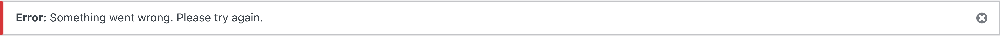
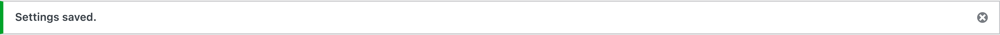
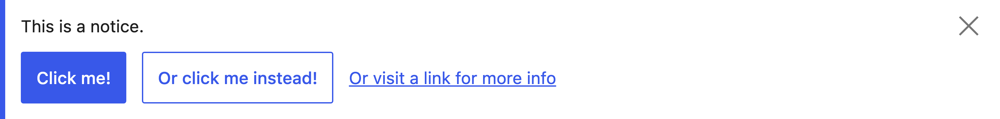

# Notices reskin

## Why this matters

Notices are a key communication mechanism in wp-admin. A consistent notice system improves clarity, reduces visual noise, and supports accessibility through predictable structure and contrast. This is useful because notices are often the first thing an editor sees after an action.

## Component inventory

### Notice types

WordPress uses four semantic notice types, each with a distinct color and left border.

```html
<!-- Info notice (blue) -->
<div class="notice notice-info">
    <p>This is an informational message.</p>
</div>

<!-- Success notice (green) -->
<div class="notice notice-success">
    <p>Settings saved successfully.</p>
</div>

<!-- Warning notice (yellow/orange) -->
<div class="notice notice-warning">
    <p>This action may have consequences.</p>
</div>

<!-- Error notice (red) -->
<div class="notice notice-error">
    <p>An error occurred. Please try again.</p>
</div>
```

### Dismissible notices

Notices can include a dismiss button that removes them from view.

```html
<div class="notice notice-success is-dismissible">
    <p>Post published.</p>
    <button type="button" class="notice-dismiss">
        <span class="screen-reader-text">Dismiss this notice.</span>
    </button>
</div>
```

### Inline notices

Inline notices stay in place and are not moved by WordPress JavaScript.

```html
<div class="notice notice-info inline">
    <p>This notice stays where it is rendered.</p>
</div>
```

### Legacy notice classes

Older screens may still use legacy classes that should be styled consistently.

```html
<div class="updated">
    <p>Legacy success notice.</p>
</div>

<div class="error">
    <p>Legacy error notice.</p>
</div>
```

## Where notices are used

| Location | Notice types | Notes |
|----------|--------------|-------|
| **Dashboard** | Info, warning | Plugin/theme update notices |
| **Settings pages** | Success, error | Form submission feedback |
| **Plugins screen** | Success, warning, error | Activation, deactivation, updates |
| **Updates screen** | Info, success | Available and completed updates |
| **Post editor** | Success, error | Publish, save, and validation feedback |
| **Media library** | Error | Upload failures |
| **User screens** | Success, error | Profile updates, user actions |

## Scope

Reskin admin notices without markup changes:

- `.notice` base styles
- `.notice-info`, `.notice-success`, `.notice-warning`, `.notice-error`
- Dismiss button alignment and focus styling
- Links inside notices
- Legacy `.updated` and `.error` classes

## Non goals

- No new notice classes.
- No new CSS custom properties for semantic colors.
- No changes to notice behavior or dismissal logic.

## Current WP Admin notices

### Individual notice components

| Type | Screenshot |
|------|------------|
| Info |  |
| Success |  |
| Warning |  |
| Error |  |

## Real-world examples

Screenshots captured from actual WP Admin pages at 8x resolution.

| Context | Screenshot |
|---------|------------|
| Settings saved success |  |

## Gutenberg Design System (Storybook)

Screenshots from the [Gutenberg Storybook](https://wordpress.github.io/gutenberg/?path=/docs/components-notice--docs) showing the target design.

| Variant | Screenshot |
|---------|------------|
| Default Notice |  |
| Notice with Actions |  |
| Snackbar |  |

## Design specifications from Figma

**Figma reference:** [Notice component](https://www.figma.com/design/804HN2REV2iap2ytjRQ055/WordPress-Design-System?node-id=15877-6195)

### Notice structure

Notices use a left border accent pattern with optional background tint.

| Property | Value |
|----------|-------|
| Left border width | 4px |
| Horizontal padding | 12px |
| Vertical padding | 8px |
| Gap (content to dismiss) | 24px |

### Notice variant colors

| Variant | Border color | Background |
|---------|--------------|------------|
| Info | #3858e9 (theme color) | transparent or white |
| Warning | #f0b849 (alert-yellow) | #fef8ee (light yellow tint) |
| Success | #4ab866 (alert-green) | #eff9f1 (light green tint) |
| Error | #cc1818 (alert-red) | #f4a2a2 (light red tint) |

### Typography

| Property | Value |
|----------|-------|
| Font size | 13px |
| Line height | 20px |
| Text color | #1e1e1e (gray-900) |

### Dismiss button

The dismiss button should be a simple icon button aligned to the top-right:

| Property | Value |
|----------|-------|
| Size | 24px |
| Icon | Close/X icon |
| Color | #1e1e1e (gray-900) |

### Button actions in notices

When notices contain action buttons:

| Button type | Style |
|-------------|-------|
| Primary | Standard primary button (theme color bg, white text) |
| Secondary | Standard secondary button (white bg, theme color border/text) |
| Tertiary | Standard tertiary button (transparent, theme color text) |

## Requirements

### Visual hierarchy

- Left border (4px) should be the primary visual indicator of notice type.
- Background tint (where specified) should be subtle and not compete with content.
- Padding: 12px horizontal, 8px vertical.
- 24px gap between content area and dismiss button.

### Color handling

Define Sass variables for notice colors (compiled to static CSS):

```scss
$notice-info-border: #3858e9;
$notice-warning-border: #f0b849;
$notice-warning-bg: #fef8ee;
$notice-success-border: #4ab866;
$notice-success-bg: #eff9f1;
$notice-error-border: #cc1818;
$notice-error-bg: #f4a2a2;
```

### Focus and accessibility

One thing to keep in mind is that notice dismissal is a frequent keyboard interaction.

- Dismiss button focus must be visible and should use `var(--wp-admin-border-width-focus)` for focus width.
- Text contrast must meet WCAG AA:
  - Info: #1e1e1e on white (21:1)
  - Warning: #1e1e1e on #fef8ee (18.5:1)
  - Success: #1e1e1e on #eff9f1 (19.2:1)
  - Error: #1e1e1e on #f4a2a2 (7.8:1)

## Deliverables

- Updated notice styling in core CSS.
- Confirmed compatibility with all bundled admin color schemes.

## Discussion checkpoints

### Semantic palette

Decisions to capture:

- Which static semantic colors are acceptable to bake into core CSS.
- How intent colors should interact with admin schemes.

## Acceptance criteria

- All notice variants are visually consistent and accessible.
- Links inside notices remain clearly identifiable.
- Dismiss buttons are aligned and keyboard accessible.
- No new CSS custom properties were introduced.

## Testing notes

It is recommended to test notices where they occur naturally:

1. Dashboard
2. Plugins screens
3. Updates screens
4. Settings screens

Test in light and modern admin schemes.

