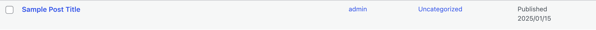
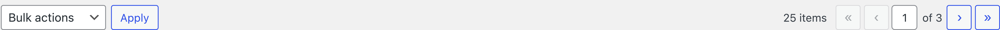
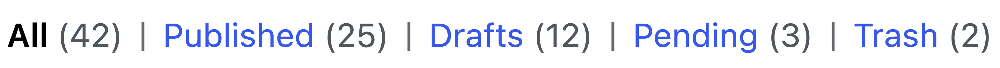
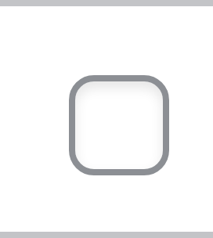

# Tables reskin

## Why this matters

List tables are one of the most frequent admin UI patterns. A light table reskin can reduce visual noise and align classic admin screens with the DataViews language, without changing functionality. This is useful because tables are where editors spend time managing content at scale.

## Component inventory

### WP List Table

The primary table pattern used for content management.

```html
<table class="wp-list-table widefat fixed striped table-view-list posts">
    <thead>
        <tr>
            <td class="manage-column column-cb check-column">
                <input type="checkbox">
            </td>
            <th class="manage-column column-title column-primary sortable desc">
                <a href="#">Title</a>
            </th>
            <th class="manage-column column-author">Author</th>
            <th class="manage-column column-date sortable asc">Date</th>
        </tr>
    </thead>
    <tbody>
        <tr>
            <th class="check-column">
                <input type="checkbox" name="post[]" value="1">
            </th>
            <td class="title column-title has-row-actions column-primary">
                <strong><a href="#">Post Title</a></strong>
                <div class="row-actions">
                    <span class="edit"><a href="#">Edit</a> | </span>
                    <span class="trash"><a href="#">Trash</a></span>
                </div>
            </td>
            <td class="author column-author">Admin</td>
            <td class="date column-date">Published<br>2025/01/15</td>
        </tr>
    </tbody>
</table>
```

### Table navigation

Pagination and bulk actions above/below tables.

```html
<div class="tablenav top">
    <div class="alignleft actions bulkactions">
        <select name="action">
            <option value="-1">Bulk actions</option>
            <option value="trash">Move to Trash</option>
        </select>
        <input type="submit" class="button action" value="Apply">
    </div>
    <div class="tablenav-pages">
        <span class="displaying-num">24 items</span>
        <span class="pagination-links">
            <a class="first-page button" href="#">&laquo;</a>
            <a class="prev-page button" href="#">&lsaquo;</a>
            <span class="paging-input">
                <input type="text" class="current-page" value="1"> of 
                <span class="total-pages">3</span>
            </span>
            <a class="next-page button" href="#">&rsaquo;</a>
            <a class="last-page button" href="#">&raquo;</a>
        </span>
    </div>
</div>
```

### Subsubsub filter links

Status filter links above list tables.

```html
<ul class="subsubsub">
    <li class="all">
        <a href="#" class="current">All <span class="count">(42)</span></a> |
    </li>
    <li class="publish">
        <a href="#">Published <span class="count">(25)</span></a> |
    </li>
    <li class="draft">
        <a href="#">Drafts <span class="count">(12)</span></a>
    </li>
</ul>
```

### Form table

Used on settings pages for label/input pairs.

```html
<table class="form-table" role="presentation">
    <tr>
        <th scope="row">
            <label for="field">Field Label</label>
        </th>
        <td>
            <input type="text" id="field" class="regular-text">
            <p class="description">Help text for this field.</p>
        </td>
    </tr>
</table>
```

### Widefat table

Simple data tables without list table features.

```html
<table class="widefat">
    <thead>
        <tr>
            <th>Column 1</th>
            <th>Column 2</th>
        </tr>
    </thead>
    <tbody>
        <tr>
            <td>Data 1</td>
            <td>Data 2</td>
        </tr>
        <tr class="alternate">
            <td>Data 3</td>
            <td>Data 4</td>
        </tr>
    </tbody>
</table>
```

## Where tables are used

| Location | Table types | Notes |
|----------|-------------|-------|
| **Posts/Pages list** | WP List Table | Primary content management |
| **Users list** | WP List Table | User management with role column |
| **Plugins list** | WP List Table | Plugin management with actions |
| **Comments list** | WP List Table | Comment moderation |
| **Media list view** | WP List Table | Alternative to grid view |
| **Settings pages** | Form table | Label/input pairs |
| **Site Health** | Widefat | Debug information display |
| **Updates screen** | Widefat | Available updates listing |

## Scope

Reskin tables without markup changes:

- `.widefat` and list tables
- Table headers and footers
- Row hover and selected states
- Stripe styles
- Bulk selection checkbox column
- Table action links and row actions
- `.subsubsub` filter links
- `.tablenav` pagination and bulk actions
- `.form-table` settings tables

## Non goals

- No DataViews functional adoption.
- No changes to column markup or list table PHP.
- No new CSS custom properties for table tokens.

## Current WP Admin tables


### Individual table components

| Component | Screenshot |
|-----------|------------|
| Table header |  |
| Table row |  |
| Form table row |  |
| Table navigation |  |
| Pagination |  |
| Bulk actions |  |
| Subsubsub filters |  |
| Checkbox column |  |

## Design specifications from Figma

### Row densities

The DataViews design defines three row densities:

| Density | Row height |
|---------|------------|
| Compact | 40px |
| Balanced | 56px |
| Comfortable | 64px |

WP Admin list tables currently use a density closest to Balanced.

### Row states

| State | Background | Border |
|-------|------------|--------|
| Default | transparent | 1px bottom rgba(0,0,0,0.1) |
| Hover | subtle tint | same |
| Selected | theme-alpha tint | same |

### Header styling

| Property | Value |
|----------|-------|
| Background | transparent |
| Border | 1px bottom rgba(0,0,0,0.1) |
| Text | #1e1e1e, slightly bolder or uppercase for column headers |

### Checkbox column

| Property | Value |
|----------|-------|
| Checkbox size | 16px |
| Column width | Fit content (~40px) |

### Row actions

Row actions appear on hover and should:
- Use link button styling
- Have visible focus states

### Pagination and table navigation

| Element | Styling |
|---------|---------|
| Pagination buttons | Default button style |
| Page input | Medium input style (32px height) |
| Bulk action select | Standard select styling |

### Subsubsub filter links

| State | Styling |
|-------|---------|
| Default | Link color, no underline |
| Current | Bold or different weight, possibly underlined |
| Hover | Theme color or underline |
| Count | Lighter text color (#5d5d5d) |

## Requirements

### Visual alignment

Define Sass tokens:

```scss
// Row styling
$table-row-border: 1px solid rgba(0, 0, 0, 0.1);
$table-row-hover-bg: rgba(0, 0, 0, 0.02);
$table-row-selected-bg: rgba(var(--wp-admin-theme-color--rgb), 0.04);

// Header styling
$table-header-bg: transparent;
$table-header-border: 1px solid rgba(0, 0, 0, 0.1);

// Densities
$table-row-height-compact: 40px;
$table-row-height-balanced: 56px;
$table-row-height-comfortable: 64px;
```

### Accent color usage

- Use `var(--wp-admin-theme-color)` for:
  - Selected row background (with alpha)
  - Active sort indicator
  - Row action link hover
- Use `--rgb` variants for any `rgba()` usage.

### Accessibility

- Ensure selected and hover states retain sufficient contrast.
- Ensure focus states for row actions and checkboxes are visible and use `var(--wp-admin-border-width-focus)`.
- Row dividers should be subtle but visible.

## Deliverables

- Updated `src/wp-admin/css/list-tables.css` styling consistent with design direction.
- A quick reference list of screens where tables were validated.

## Discussion checkpoints

### Density strategy

Decisions to capture:

- Which density is the default for admin list tables.
- Whether any screens require a special density to avoid layout regressions.

## Acceptance criteria

- Tables feel more modern while maintaining the existing information hierarchy.
- No regressions in row actions, bulk actions, or pagination UI.
- No new CSS custom properties were introduced.

## Testing notes

It is recommended to test on the busiest list tables first:

1. Posts list
2. Pages list
3. Users list
4. Plugins list

Test row hover and selected styles in at least two schemes.

